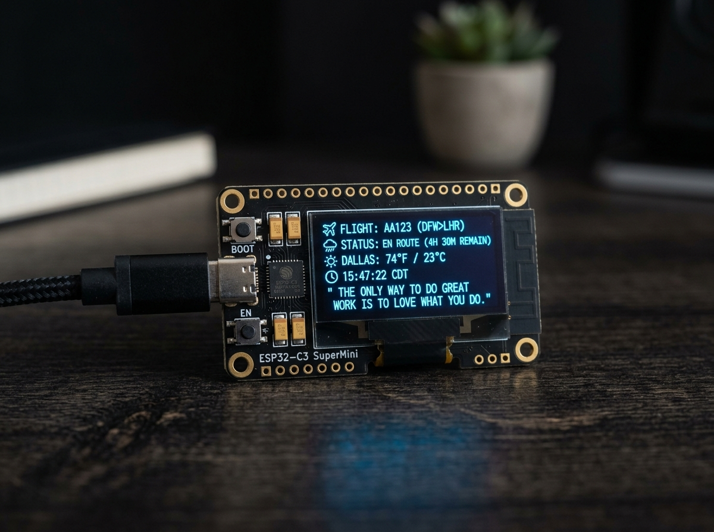

# Pabolu Vineeth — Software Developer Portfolio 💻⚡

A modern, high-performance developer portfolio built with **React**, **TypeScript**, **Vite**, **TailwindCSS**, and **Framer Motion**, featuring an interactive command-line terminal, live code runner, dark/light theme switching, and deep-dive case studies for software engineering, data analytics, and IoT projects.



---

## ✨ Features & Interactive Modules

- 🌓 **Dark & Light Mode Toggle**: Seamless theme switching with custom CSS variables and smooth ambient background glows.
- 📟 **Interactive ZSH Terminal**: Fully functional embedded command-line interface supporting commands like `help`, `whoami`, `projects`, `skills`, `contact`, `open <section>`, `sudo hire vineeth`, `ls`, `cat`, and `coffee`.
- 💻 **Live Simulated Code Runner**: Real-time animated terminal execution showing line-by-line Python code interpretation for live weather API fetches.
- 🎨 **Custom SVG Art & Screenshots**: Abstract vector visual cards (`Artwork.tsx`) paired with production screenshot evidence for every project.
- 🔍 **Individual Project Deep-Dives**: Dedicated routes (`/project/:id`) breaking down problem statements, technical approach, hardware/software stack facts, key performance metrics, and direct GitHub links.
- 📱 **Responsive & Accessible**: Mobile-first fluid typography and layout design built with Framer Motion animations and ARIA screen-reader support.
- ⚡ **Vercel SPA Deployment Ready**: Includes pre-configured `vercel.json` rewrite rules to prevent 404 errors on route refreshes.

---

## 🚀 Featured Projects

| Project | Stack | Description | Repo |
| :--- | :--- | :--- | :---: |
| **PocketDash** | `ESP32-C3`, `C++`, `OLED`, `REST APIs` | Wi-Fi smart pocket dashboard displaying live aircraft radar (ADSB.lol), weather & AQI (Open-Meteo), clock (NTP), and quotes (ZenQuotes). | [View Repo](https://github.com/pv2004/PocketDash) |
| **Smart Result Management System** | `Python`, `Tkinter`, `SQLite`, `bcrypt` | Desktop application managing student records for 500+ students with bcrypt faculty auth and validated entry. | [View Repo](https://github.com/pv2004/Student-Result-Management-System) |
| **Banking Data Analysis Dashboard** | `Power BI`, `Python`, `Excel` | Financial analytics model evaluating $4.38B in loans vs $3.77B in deposits across 5,000+ customer transactions. | [View Repo](https://github.com/pv2004/Banking-Analytics-Dashboard) |
| **Weather Forecast Web App** | `HTML`, `CSS`, `JavaScript`, `REST API` | Lightweight responsive web app fetching live conditions for 200+ cities with sub-2-second async renders. | — |
| **Gemini AI on NodeMCU ESP8266** | `ESP8266`, `Arduino`, `Gemini AI` | Real-time AI response streaming on a micro-controller over serial communication. | [View Repo](https://github.com/pv2004/GeminiAI-on-NodeMCU-ESP8266) |
| **F1 Race Pace Prediction** | `Python`, `ML`, `FastF1`, `scikit-learn` | GradientBoostingRegressor predicting Formula 1 lap pace using 2024 Saudi Arabian GP telemetry data. | [View Repo](https://github.com/pv2004/Formula-1-Race-Pace-Prediction-Saudi-Arabian-GP-2025) |
| **3D Aircraft Orientation Visualizer** | `ESP8266`, `MPU6050`, `Three.js` | Wireless 3D aircraft attitude indicator streaming real-time yaw/pitch/roll telemetry over WebSockets. | [View Repo](https://github.com/pv2004/3D-Visualization-of-Aircraft-Orientation) |
| **Smart Car Parking System** | `Arduino`, `IR Sensors`, `Servo` | Automated parking slot detection and servo gate barrier control with real-time LCD counter. | [View Repo](https://github.com/pv2004/Car-Parking-System-Using-Arduino) |

---

## 🛠️ Tech Stack & Architecture

- **Framework**: [React 19](https://react.dev/) + [Vite 6](https://vitejs.dev/)
- **Language**: [TypeScript](https://www.typescriptlang.org/)
- **Styling**: [TailwindCSS v3](https://tailwindcss.com/)
- **Animations**: [Framer Motion](https://www.framer.com/motion/)
- **Icons**: [Lucide React](https://lucide.dev/)
- **Routing**: [React Router v7](https://reactrouter.com/)
- **Deployment**: [Vercel](https://vercel.com/)

---

## 💻 Local Development Setup

Clone the repository and install dependencies:

```bash
# 1. Clone the repository
git clone https://github.com/pv2004/Portfolio-Site.git

# 2. Navigate to directory
cd Portfolio-Site

# 3. Install dependencies
npm install

# 4. Start local development server
npm run dev
```

The application will run locally at **`http://localhost:5173/`**.

### Building for Production

To create an optimized production build:

```bash
# Type check & build bundle
npm run build

# Preview build locally
npm run preview
```

---

## 📬 Contact & Connect

- **Name**: Pabolu Vineeth
- **Email**: [harivineeth51@gmail.com](mailto:harivineeth51@gmail.com)
- **Phone**: +91 91007 33701
- **LinkedIn**: [linkedin.com/in/pabolu-vineeth](https://www.linkedin.com/in/pabolu-vineeth-129b4626b/)
- **GitHub**: [github.com/pv2004](https://github.com/pv2004)

---

© 2026 Pabolu Vineeth. Built with purpose & clean code.
